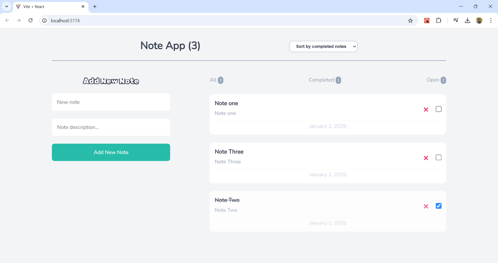
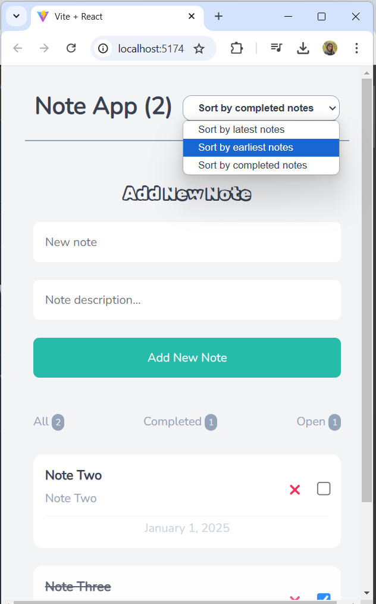

# A Notes App by Elle Famkar (developed with React)

## Welcome to the Note Apps project! 👋

important point : remember to install node package and then command -> npm run dev so as to start the project

## Table of contents

- [Overview](#overview)
  - [The challenge](#the-challenge)
  - [Screenshot](#screenshot)
  - [Links](#links)
- [My process](#my-process)
  - [Built with](#built-with)
  - [What I learned](#what-i-learned)
  - [Continued development](#continued-development)
  - [Useful resources](#useful-resources)
- [Author](#author)
- [Acknowledgments](#acknowledgments)

## Overview

Thank you for exploring this React project! The goal was to gain experience with React and hooks, and I enjoyed using pure CSS for styling. I hope you enjoy it and welcome your feedback!

Remember that "Every day is a learning day", so let's checkout the requirements to start such project

### The challenge

In his project you should be able to:

- Have a good react mindset
- good state management
- lift states up
- work with children props
- View the optimal layout for the component depending on differeent device screen size
- Use react hooks

### Screenshot




### Links

- Live Site URL: [Notes App](https://ellefamkar.github.io/perfume-shop/)

## My process

### Where to find resources

We know what we need first, yes! you are right, the design file. So let's checkout this repository to find even the smallest details about the style requirements of this project such as `font-size`, `padding` and `margin` as well as finding all the required assets in the `/images` folder. The assets are already optimized. All the compontents structures are available here.

### Built with

- Semantic HTML5 markup
- react
- react hooks
- vite
- Desktop-first workflow

You can use any tools you like to help you complete the project. So if you got something you'd like to practice, feel free to give it a try.

### What I learned

This projects helped me being more confident with the details of react components, hooks and react mindset to create a responsive Note App with.

To see parts of my codes and see how you can add code snippets, see below:

```Jsx
import { createContext, useContext, useReducer } from "react";

const NotesContext = createContext(null);
const NotesDispatchContext = createContext(null);

const noteReducer = (notes, { type, payload }) => {
  switch (type) {
    case "Add":
      return [...notes, payload];
    case "Delete":
      return notes.filter((note) => note.id !== payload);
    case "Completed": {
      return notes.map((note) =>
        note.id === payload ? { ...note, completed: !note.completed } : note
      );
    }
    default:
      throw new Error("Unknown Error" + type);
  }
};

export function NotesProvider({ children }) {
  const [notes, dispatch] = useReducer(noteReducer, []);

  return (
    <NotesContext.Provider value={notes}>
      <NotesDispatchContext.Provider value={dispatch}>
        {children}
      </NotesDispatchContext.Provider>
    </NotesContext.Provider>
  );
}

export function useNotes() {
  return useContext(NotesContext);
}

export function useNotesDispatch() {
  return useContext(NotesDispatchContext);
}

import { useState } from "react";
import { useNotesDispatch } from "../context/NotesContext";

function AddNewNote() {
  const dispatch = useNotesDispatch();

  let [title, setTitle] = useState("");
  let [description, setDescription] = useState("");

  const handleSubmit = (e) => {
    e.preventDefault();

    if (!title || !description) return null;

    const newNote = {
      title,
      description,
      id: Date.now(),
      completed: false,
      createdAt: new Date().toISOString(),
    };

    dispatch({ type: "Add", payload: newNote });
    setTitle("");
    setDescription("");

    console.log(newNote);
  };

  return (
    <>
      <div className="add-new-note">
        <h2>Add New Note</h2>
        <form className="note-form" onSubmit={handleSubmit}>
          <input
            value={title}
            onChange={(e) => setTitle(e.target.value)}
            type="text"
            className="text-field"
            placeholder="New note"
          />
          <input
            value={description}
            onChange={(e) => setDescription(e.target.value)}
            type="text"
            className="text-field"
            placeholder="Note description..."
          />
          <button type="submit" className="btn btn--primary">
            Add New Note
          </button>
        </form>
      </div>
    </>
  );
}

```

```css

@font-face {
  font-family: 'RubikVinyl';
  src: url('./fonts/RubikVinyl-Regular.ttf') format('truetype');
  font-weight: normal;
  font-style: normal;
}

:root {
  /* font-family: Inter, system-ui, Avenir, Helvetica, Arial, sans-serif; */
  --bg-color: #f3f4f6;
  --text-700: #374151;
  --text-400: #94a3b8;
  --text-100: #f3f4f6;
  --text-300: #cbd5e1;
  --white: #fff;
  --primary-700: #4338ca;
  --primary-600: #4f46e5;
  --primary-100: #e0e7ff;
  --rose-500: #f43f5e;
  --btn-primary : #27bca9;
}

.note-header {
  display: flex;
  align-items: center;
  justify-content: space-evenly;
  margin-bottom: 3rem;
  border-bottom: 2px solid var(--text-400);
}

.note-app {
  display: flex;
  justify-content: space-between;
  gap: 2rem;
}

.note-form {
  gap: 1.5rem;
  display: grid;
}

.add-new-note {
  width: 30%;
}

.note-container {
  width: 60%;
}

.note-status {
  display: flex;
  justify-content: space-between;
  color: var(--text-400);
  margin-bottom: 2rem;
}

.note-status span {
  border-radius: 2rem;
  display: inline-block;
  background-color: var(--text-400);
  padding: 0.2rem 0.3rem;
  font-size: 0.75rem;
  color: var(--text-100);
}

.note-item {
  padding: 1rem;
  background-color: #fff;
  border-radius: 0.75rem;
  margin-bottom: 1.5rem;
}


```

### Continued development

In my future projects, not only i am going to focus on improving my knowledge of front end development (html and css), but also i will make it more dynamic and use react and typeScript so as to develop cooler projects. I will also try to be much more familiar with UI design so as to better understand my clients needs and requirements.

### Useful resources

In order to do this project in a correct way you need to have a good knowledge of html and pure css and grid and then tailwind and you need to know how to work with alpine js in the project and connect it to css if you want to use js.

- [w3schools](https://www.w3schools.com/)
- [MDN](https://developer.mozilla.org/en-US/) - Remember that no matter how many tutorial videos you have watched, you always need to learn details and features from codes documentations
- [codeacademy](https://www.codecademy.com/)
- [udemy](https://www.udemy.com/) - Here you can find a number of tutorials in different languages
- [coursera](https://www.coursera.org/)

To my persian friends:
You can benefit from this complete article on which sources to use to master flex and grid.

## Author

- Website - My website is under construction but you can find my works here : [Elle Famkar](https://github.com/ellefamkar)
- Twitter - [@Ellefamkar](https://www.twitter.com/ellefamkar)

Feel free to ask any questions come to your mind on my github account!

## Acknowledgments

I want to thanks my react mentor, [Saheb Mohammadi](https://www.fronthooks.ir/), who has been inspiring and helpfull with great projects, tips and lessons.

**Have fun using this project!** 🚀
